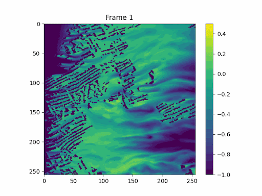

# Leo Mok

I'm a deep learning practitioner with a Master's from Imperial, and I have worked with top research labs at Imperial College London and HKU. I have 1 year professional experience with a private funded research lab under HKU. 
I'm interested in:

- AI applications for science
- C++ and High Performance Computing
- Bioinformatics
- Building Efficient Software

## Projects

Check out some of the things I've been working on:
- [Fluid Dynamics Generative Foundational Model](/fluid-dynamics) (Publication under submission)

- [C++ DNA alignment tool](\cpp-dna-alignment)
- [Deep learning DNA Hash database](\dna-hash) (WIP Publication)
- [DNA metadata RAG tool using Huggingface BERT and LLMs]
- [C++ image processing tool]
👉 [View my projects](/project)

## Contact

You can find me on:

- GitHub: [leomok82](https://github.com/leomok82)
- Email: leomok82@gmail.com
