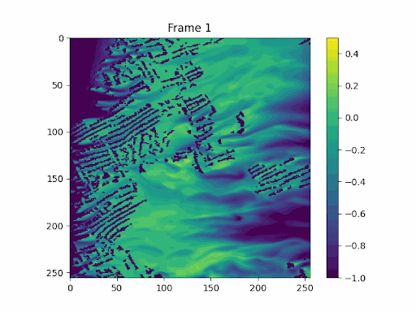
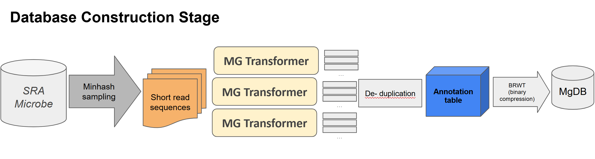

I'm Leo, currently a contractor @ Meta FAIR (via Salt). 

I like AI/ML research, especially algorithms for cool applications like DNA and Fluid Dynamics, and making things run fast on GPU clusters with distributed systems and CUDA kernels. 

I have worked with top research labs at Meta, Imperial College London, HKU, and hopefully many more collaborators to come! I'd say the most interesting one is the DNA language model (BERT) for database searching, similar to RA for DNA!
I'm interested in:

- AI applications for science
- C++ and High Performance Computing
- Bioinformatics

## Projects

Check out some of the things I've been working on:
- [Fluid Dynamics Generative Foundational Model](/fluid-dynamics) (Publication under submission)

- [Deep learning DNA Hash database](\dna-hash) 

- [C++ DNA alignment tool](\cpp-dna-alignment)

- [DNA metadata RAG tool using Huggingface BERT and LLMs](\dna-metadata-rag)

Code Sample:
- [C++ image processing tool](https://github.com/leomok82/ImageProcessing)

## Contact

You can find me on:

- GitHub: [leomok82](https://github.com/leomok82)
- Email: leomok82@gmail.com
