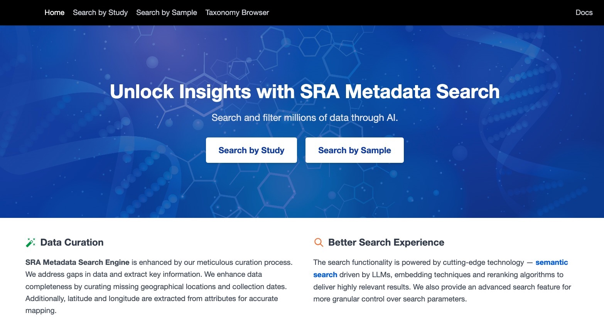

<section class="hero">
  

    

      <h1>Hi, I'm Leo Mok</h1>
      
Research Engineer (Contractor) @ Meta FAIR

      

        I build AI/ML systems — from DNA language models to fluid dynamics simulations — and make them run fast on GPU clusters with distributed systems and CUDA kernels.
      

      

        I have worked with top research labs at Meta, Imperial College London, HKU, and hopefully many more collaborators to come! Currently working with the Data foundations team @ Meta FAIR. I'd say the most interesting one is the DNA language model (BERT) for database searching, similar to RAG for DNA.
      

      

        AI applications for science
        C++ & High Performance Computing
        Bioinformatics
      

      

        Collaborated with
        

          Meta
          Imperial College London
          HKU
        

      

    

    

      
    

  

</section>

<section class="section" id="projects">
  

    
Portfolio

    <h2 class="section-title">Projects</h2>
  

  

    

      

        
      

      

        
📅 Sep 2024 – Present

        <h3 class="project-card-title"><a href="/fluid-dynamics">Fluid Dynamics Generative Foundational Model</a></h3>
        
Scalable generative foundational model for computational physics, achieving 15x speedup over traditional CFD solvers.

        

          Publication under submission
        

      

    

    

      

        
      

      

        
📅 Sep 2024 – Aug 2025

        <h3 class="project-card-title"><a href="/dna-hash">Deep Learning DNA Hash Database</a></h3>
        
A deep learning approach to DNA sequence hashing for efficient database searching using learned embeddings.

        

          Completed
        

      

    

    

      

        
📅 Sep 2024 – Aug 2025

        <h3 class="project-card-title"><a href="/cpp-dna-alignment">C++ DNA Alignment Tool</a></h3>
        
High-performance DNA sequence alignment tool implemented in C++ for fast genomic analysis.

        

          Completed
        

      

    

    

      

        
📅 Sep 2024 – Aug 2025

        <h3 class="project-card-title"><a href="/dna-metadata-rag">DNA Metadata RAG Tool</a></h3>
        
Retrieval-Augmented Generation tool using HuggingFace BERT and LLMs for DNA metadata search and retrieval.

        

          Completed
        

      

    

    

      

        
📅 Jun 2024

        <h3 class="project-card-title"><a href="https://github.com/leomok82/ImageProcessing">C++ Image Processing Tool</a></h3>
        
Image processing library written in C++ with various filters and transformation algorithms.

        

          Code Sample
        

      

    

  

</section>

<section class="section" id="contact">
  

    

      <h3>Contact</h3>
      
You can find me on:

    

    

      <a href="https://github.com/leomok82" class="contact-btn contact-btn-primary" target="_blank" rel="noopener">
        GitHub →
      </a>
      <a href="mailto:leomok82@gmail.com" class="contact-btn contact-btn-secondary">
        Email →
      </a>
    

  

</section>
